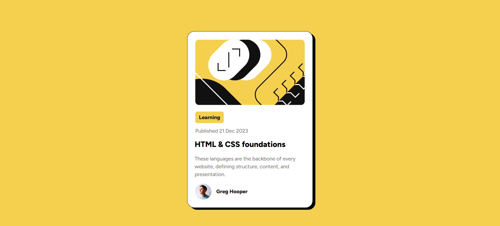
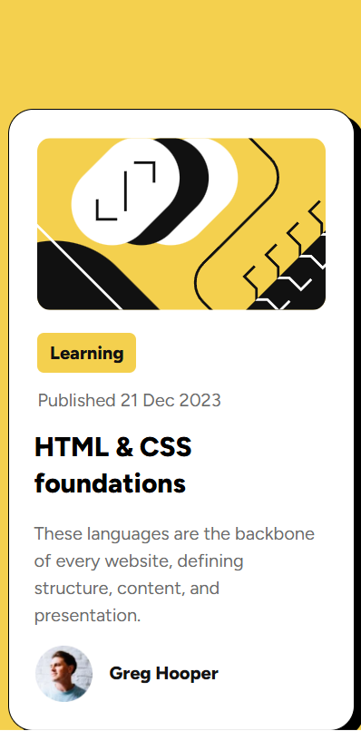

# Blog Preview Card

This is a simple Blog Preview Card built using HTML and CSS. It displays a featured blog post with an image, category, publication date, title, short description, and author details.





## Features

- Responsive design for different screen sizes.
- Uses Google Fonts (Figtree).
- Displays a structured blog preview card with an image, title, description, and author.
- Includes a favicon.

### Dependencies
- Google Fonts: Inter (400-900 weights with italics)
- External CSS stylesheet

## Setup Instructions

1. Clone repository:
```bash
git clone https://github.com/Amitk4600/Blog-preview-card.git